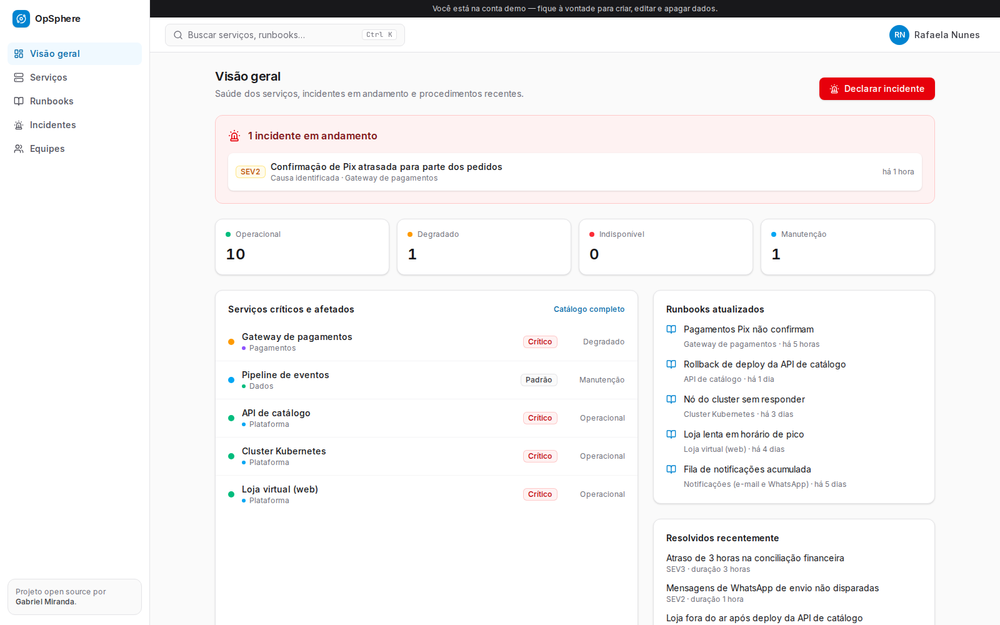
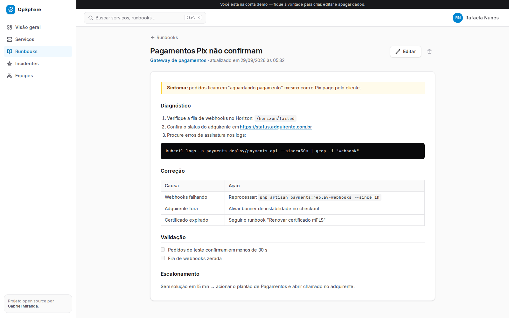

# Op Sphere


**Operations hub for IT teams.** A service catalog that says who owns what and how critical it
is, markdown runbooks attached to each service, incident management with a status timeline and
post-mortems — plus a global `Ctrl+K` search to find any of it in seconds.



**Live demo:** [opsphere-console.vercel.app/demo](https://opsphere-console.vercel.app/demo) — signs in straight to a sample account.

> **Try it:** open the app and click **"Explorar com a conta demo"** — an e-commerce operations
> workspace with 4 teams, 12 services, 6 runbooks and an ongoing incident.
> (`demo@opsphere.dev` / `demo1234`)

## Features

| | |
| --- | --- |
| **Service catalog** | Owner team, tier (critical/high/standard), live status, tags and links (production, dashboards, repository…), grouped and filterable by team. |
| **Runbooks** | Markdown with tables, code blocks and checklists (GFM), side-by-side write/preview editor, linked to services. |
| **Incidents** | SEV1–SEV3, status timeline (investigating → identified → monitoring → resolved). Declaring an incident degrades the affected services; resolving restores them unless another incident is still open. |
| **Post-mortems** | Built-in template (impact, root cause, action items) stored with the incident. |
| **Context when it matters** | The incident page lists the runbooks of every affected service. |
| **Global search** | `Ctrl+K` palette searching services (name, description, tags), runbooks (title and content) and incidents. |



## Architecture

- **Server Components + Server Actions** — no REST layer to secure separately; every query and
  mutation filters by the signed-in owner.
- **Atomic state changes** — declaring/resolving an incident, writing its timeline entry and
  updating the status of the affected services run inside a single Prisma transaction.
- **Data model** — many-to-many `Incident ↔ Service`, native Postgres arrays for tags and JSONB for
  service links, indexes by owner/status.
- **Safe markdown** — `react-markdown` renders without raw HTML, so runbook content can't inject
  scripts.

```
src/
  app/app/            authenticated area (overview, services, runbooks, incidents, teams)
  lib/actions.ts      Server Actions (Zod-validated, owner-scoped)
  lib/queries.ts      read models for each page
  components/ops/     forms, markdown, timeline, status menu
  components/search/  Ctrl+K command palette (cmdk)
```

## Running locally

Requirements: Node.js 22+, Docker.

```bash
cp .env.example .env.local        # then set AUTH_SECRET (npx auth secret)
npm install
npm run setup                     # Postgres + migrations + demo workspace
npm run dev                       # http://localhost:3104
```

## History

This repository started as a React/Vite console for the
[opsphere-api](https://github.com/pGabrielM/opsphere-api) (sector → category → panel links).
It was rebuilt as a full-stack Next.js app that keeps the original idea — organizing operational
knowledge by area — and turns it into something a real on-call team can use.

## Stack

Next.js 16 · React 19 · TypeScript · Prisma 7 · PostgreSQL · Auth.js v5 · Zod · react-markdown ·
cmdk · Radix UI · Tailwind CSS 4

---

Built by [Gabriel Miranda](https://www.letinfo.dev) · MIT License
